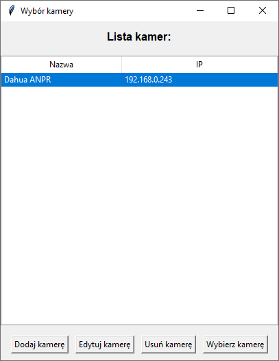
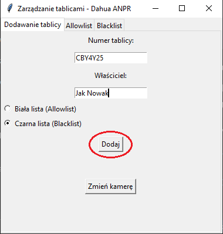

# Wielokamerowy system zarządzania tablicami rejestracyjnymi (Dahua ANPR)

Aplikacja desktopowa do zarządzania listami tablic rejestracyjnych (białą i czarną) na kamerach Dahua wyposażonych w funkcję ANPR (Automatic Number Plate Recognition). Umożliwia pracownikom zarządzanie wieloma kamerami z jednego miejsca, bez konieczności logowania się do interfejsu webowego każdej kamery z osobna.

Dane kamer przechowywane są lokalnie, a hasła zabezpieczone szyfrowaniem. Komunikacja z kamerami odbywa się poprzez API Dahua z uwierzytelnianiem HTTP Digest.

---

# Zrzuty ekranu

**Główne menu aplikacji**

**Dodawanie tablicy do listy**

---

# Użyte Technologie

| Technologia | Zastosowanie |
|---|---|
| Python | Język aplikacji |
| Tkinter | Interfejs graficzny (GUI) |
| requests | Komunikacja HTTP z API kamer |
| HTTP Digest Auth | Uwierzytelnianie połączeń z kamerami Dahua |
| cryptography (Fernet) | Szyfrowanie haseł kamer przechowywanych lokalnie |
| JSON | Lokalne przechowywanie danych kamer |

---

# Funkcjonalności

- Dodawanie, edycja i usuwanie kamer z lokalnej listy
- Szyfrowane przechowywanie danych uwierzytelniających kamer
- Testowanie połączenia z kamerą przed zalogowaniem
- Przeglądanie białej listy (Allowlist) i czarnej listy (Blacklist) tablic
- Dodawanie i usuwanie tablic rejestracyjnych na kamerze
- Walidacja formatu adresu IP
- Obsługa wielu kamer w ramach jednej aplikacji

---

# Artykuły techniczne

Projekt opisany szczegółowo w artykułach technicznych:

- [Integracja kamer ANPR Dahua z aplikacją desktopową przez API](https://www.kamery-ip.com/Integracja-kamer-ANPR-Dahua-z-aplikacja-desktopowa-przez-API-a485.html)
- [Pobieranie nagrań z rejestratora NVR Dahua przez API w aplikacji desktopowej](https://www.kamery-ip.com/Pobieranie-nagran-z-rejestratora-NVR-Dahua-przez-API-w-aplikacji-desktopowej-a487.html)